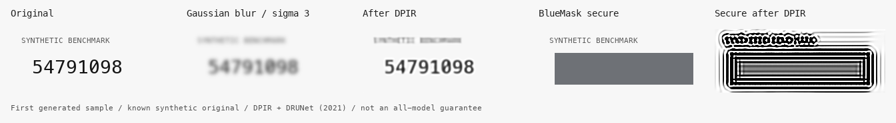

# One released model, twelve synthetic text samples

**Measured 6 September 2026:** DPIR with DRUNet recovered all twelve synthetic
tokens from conventional Gaussian blur at sigma 3. Three had not been recognized
exactly before restoration. None of the twelve original tokens was recognized
in BlueMask's secure exports after the same restoration settings.

| Input | Exact tokens read before restoration | Exact tokens read after DPIR |
|---|---:|---:|
| Unredacted control | 12 / 12 | Not applicable |
| Gaussian blur, sigma 2 | 12 / 12 | 12 / 12 |
| Gaussian blur, sigma 3 | 9 / 12 | 12 / 12 |
| BlueMask secure mask, assumed sigma 2 | 0 / 12 | 0 / 12 |
| BlueMask secure mask, assumed sigma 3 | 0 / 12 | 0 / 12 |

The baseline is [DPIR with DRUNet (2021)](https://github.com/cszn/DPIR), using
the authors' released architecture and grayscale weights. It is an established
baseline. **This is not a test against all AI, current frontier models or an
anonymity guarantee.**

The dataset contains twelve artificial eight-digit strings, one font and fixed
mask geometry. Exact recovery means local Apple Vision OCR returned the full
known token in one line, after whitespace removal. The model received the exact
Gaussian kernel for the conventional-blur controls. Those controls are generated
Gaussian blur, not BlueMask's cosmetic-blur implementation. No model retraining,
parameter search, candidate dictionary, private photos or paid API was used.

The secure PNGs came from the actual BlueMask canvas renderer. They are all
**byte-identical** despite containing twelve different original tokens. Identical
masked inputs were processed once per assumed kernel and reused transparently;
these are not twelve independent adversarial trials. The evidence is that these
published pixels do not distinguish the twelve tested originals. It says nothing
about sensitive pixels a user leaves uncovered, mask geometry variation, or clues
in surrounding context.

For sigma 3, mean pixel similarity within the selected region improved from
14.85 to 20.02 dB PSNR. PSNR is image similarity, not a privacy score. Restored
secure images produced visible artifacts, not the known secret tokens. OCR can
miss information that a human or a different model could read; all transcriptions
and images are available for inspection.

The model run took 5.86 seconds on local Apple MPS. The benchmark process and its
child OCR process ran with network access denied by a macOS process sandbox.
Dependency and weight downloads happened beforehand. Source commit, checkpoint
hash, engine hash, browser version, exact commands, complete rows and limitations
are recorded in the JSON evidence beside this file. Reproduction instructions
and source are in `research/README.md` in the downloadable evidence archive.

Faces, real documents, pixelation, inpainting, context inference and combinations
of multiple exports have not been evaluated here. Current frontier-model
evaluation remains pending; no unrun model is claimed to have been defeated.

A [recent-model cross-check with DarkIR (CVPR 2025)](darkir/SUMMARY.md) also ran.
It made the relevant Gaussian-blur controls less readable and is explicitly
excluded from strong masking-resistance claims. Its full result is retained,
including that failed control, instead of reporting its secure-mask failure as
a win.
